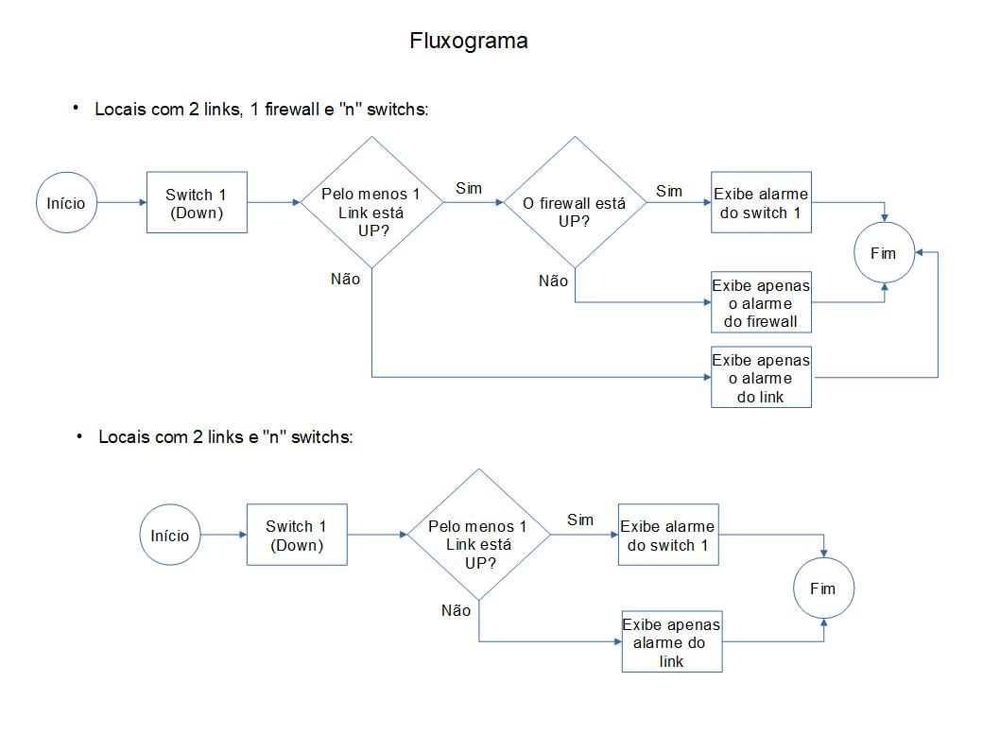

# Shell-Script

#### monitora_log_por_tempo.sh:

Script desenvolvido para verificar os últimos X minutos de um arquivo de log (neste exemplo estamos utilizando um log do nginx), indicando por exemplo:

- Falha quando não é possível ler o log;
- A quantidade de erros (baseada na lista de códigos de estado HTTP);

Uma das premissas durante o desenvolvimento era facilitar a manipulação dos dados de referência de checagem de logs e quantidade de erros utilizados para comparação.


#### gera_conf_local_nagios.sh:

Script em Shell Script criado para automatizar tarefas. Esta demanda surgiu pela necessidade constante de inserção de equipamentos de rede nas configurações do Nagios e como a equipe de Telecom sempre enviava as informações no mesmo padrão, pensamos em gerar algo que lê-se esse arquivo e criasse tudo analisando cada cenário, ou seja, dependendo das informações passadas as dependências mudariam.

Script para automatizar a criação dos arquivos de configuração do Nagios (links, firewall e switchs). É feita a leitura de um arquivo csv e a partir daí o script valida as informações (por exemplo, se o IP possui um formato válido) e cria os arquivo de configuração, levando também em consideração alguns critérios de dependência (aqui utilizamos o recurso parents do Nagios) e condições de existência ou não de certos objetos.



Exemplo de csv.
```
LOCAL;SERVIDOR;LINK A LAN;LINK B LAN;LINK A WAN;LINK B WAN;FIREWALL INT;FIREWALL EXT;SWITCH 1;SWITCH 2;SWITCH 3;SWITCH 4;SWITCH 5;SWITCH 6;SWITCH 7;SWITCH 8
local0001;111.111.111.111;222.222.222.222;333.333.333.333;444.444.444.444;555.555.555.555;NÃO POSSUI;NÃO POSSUI;666.666.666.666;777.777.777.777;888.888.888.888;NÃO POSSUI;NÃO POSSUI;NÃO POSSUI;NÃO POSSUI;NÃO POSSUI
```

#### service_restart.sh:

Shell script para dar um "tapinha" no serviço que parou e já não atualizar o arquivo de logo a x minutos. (deve ser apreciado com moderação hehe, foi uma solução de contorno temporária)
